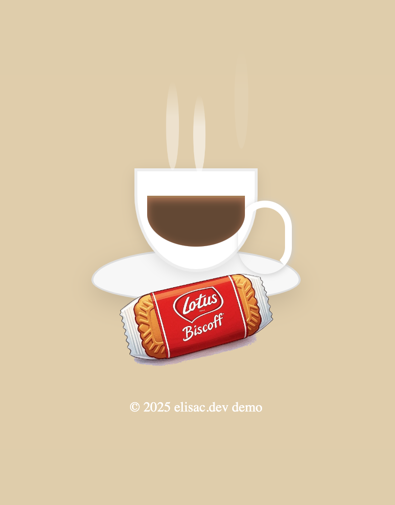

# ☕️ Hot Coffee CSS Demo

A pure HTML and CSS demo of a steaming cup of coffee on a saucer, with animated steam and a falling biscuit.  
No JavaScript required!
Responsive enabled




## Features

- **Pure CSS Art:** Cup, saucer, coffee, and handle drawn with CSS.
- **Animated Steam:** Realistic, animated steam rising from the coffee.
- **Biscuit Drop:** A biscuit image drops in front of the cup with a smooth animation.
- **Responsive Design:** Looks good on most modern browsers and screen sizes.

## Demo

<a href="https://ec-wa.github.io/css-demo/hot-coffee/coffee.html" target="_blank" rel="noopener noreferrer">View Live Demo</a>


## Usage

1. **Clone the repository:**
   ```bash
   git clone https://github.com/ec-wa/css-demo.git
   ```
2. **Open `index.html` in your browser.**
3. **(Optional) Replace `biscoff.png` with your own biscuit image.**

## Folder Structure

```
/hot-coffee/
├── index.html
├── style.css
├── biscoff.png
└── README.md
```

## Customization

- **Biscuit Image:** Replace `biscoff.png` with your own image for a different biscuit.
- **Coffee Color:** Adjust the `.coffee` CSS class for different shades of coffee.
- **Animation Speed:** Tweak keyframes in `style.css` for faster or slower steam/biscuit drop.

## License

MIT License