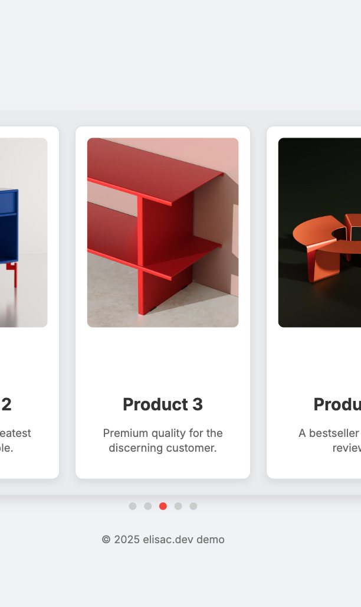

# 🏞️ Hover Enlarge Product Slider with Navigation

A sleek, responsive product slider built with HTML, CSS, and JavaScript. Features smooth horizontal scrolling, card enlargement on hover/focus, and intuitive dot navigation. Perfect for ecommerce product showcases and portfolio carousels!



## Features

- **Horizontal scrolling:** Easily swipe or scroll through products
- **Smooth hover zoom:** Cards and images enlarge on hover/focus for visual pop
- **Dot navigation:** Jump to any slide and highlight the current one
- **Responsive:** Looks great on desktop, tablet, and mobile
- **Accessible:** Keyboard navigation (tab and arrow key support)
- **No external dependencies** (except optional Google Fonts)

## Demo

[View Live Demo](https://ec-wa.github.io/css-demo/hover-enlarge-slider/index.html)

## How to Use

1. **Clone this repo:**
    ```bash
    git clone https://github.com/ec-wa/hover-enlarge-slider.git
    ```

2. **Open in your browser:**

    - Open `index.html` directly in your web browser.
    - Or serve via your preferred dev server for local development.

## File Structure

```
/hover-enlarge-slider/
├── index.html
├── hover-enlarge-slider.css
├── hover-enlarge-slider.js
├── README.md
└── hover-enlarge-slider.jpg
```

- **index.html** — Demo page markup
- **hover-enlarge-slider.css** — All styles for layout, animations, and responsiveness
- **hover-enlarge-slider.js** — JavaScript for navigation and slider logic
- **README.md** — This guide
- **hover-enlarge-slider.jpg** — Slider in responsive view

## Customization

- Adjust **card width** and number of visible cards by editing `.slider-frame` and `.product-card` width in CSS.
- Change transition duration/timing in `.product-card`, `.product-card img`, etc.
- Add or remove cards by duplicating/changing the HTML within `.product-slider`.
- Swap images for your own products.

## Responsive Design

The slider adapts to various screen sizes using CSS media queries. On smaller devices, cards shrink in width for optimal viewing.

## Accessibility

- Cards are keyboard focusable (`tabindex="0"`).
- Hover/focus triggers the enlarge animation.
- Dot navigation is focusable and clickable.

## License

MIT © 2025 elisac.dev