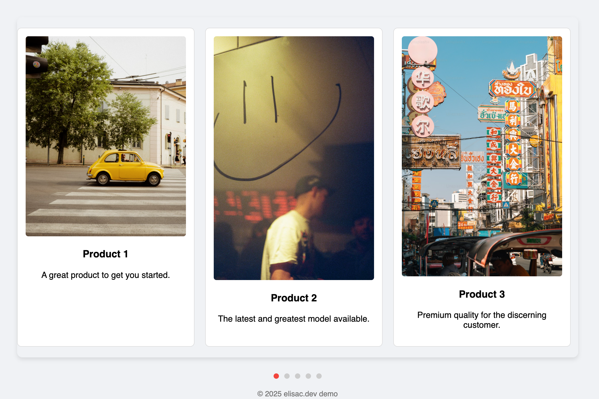

# 🏞️ Simple Product Slider Demo

A minimal, easy-to-use HTML, CSS, and JavaScript product slider—perfect for portfolios, stores, demos, or landing pages. Responsive supported! 



## Features

- **Clean product card layout** with images, titles, and descriptions
- **Navigation dots** for easy slide switching
- **Responsive** design, usable on all devices
- **Easily customizable**: swap images and text for your own content
- **Light-weight slider**: html + css + light JavaScript

## Demo

[View Live Demo](https://ec-wa.github.io/css-demo/simple-slider/index.html)

## Getting Started

Clone or download this repository. You’ll find:

- `index.html` – Main HTML file
- `simple-slider.css` – Styling for slider and navigation
- `simple-slider.js` – JavaScript to activate slider navigation

### 1. Include the Files

```html

 <link rel="stylesheet" href="simple-slider.css">
 <script src="simple-slider.js"></script>

```

Make sure both the CSS and JS are in the same directory as your HTML, or update the paths if placed elsewhere.

### 2. Edit Product Cards

Replace image URLs, titles, and descriptions in the HTML as needed:

```html

    
 <div class="product-card" data-card-index="0">
    
    <h3>Product Name</h3>
    <p>Short product description goes here.</p>
 </div>


```

You can add, remove, or reorder product cards. Add corresponding `.nav-dot` elements for each card in the slider navigation.

## Folder Structure

```
/simple-slider/
├── index.html
├── simple-slider.css
├── simple-slider.js
└── README.md
```

## Customization

- **Fonts:** Uses [Inter](https://fonts.google.com/specimen/Inter) from Google Fonts (already linked in the demo).
- **Products:** Update the product cards as needed.
- **Styling:** Edit `simple-slider.css` to match your branding or layout preferences.
- **Behavior:** Extend `simple-slider.js` for more features like swiping, autoplay, etc.

## Browser Support

Tested on the latest versions of Chrome, Firefox, Safari, and Edge. Fully works on both desktop and mobile browsers.

## License

MIT © 2025 elisac.dev
